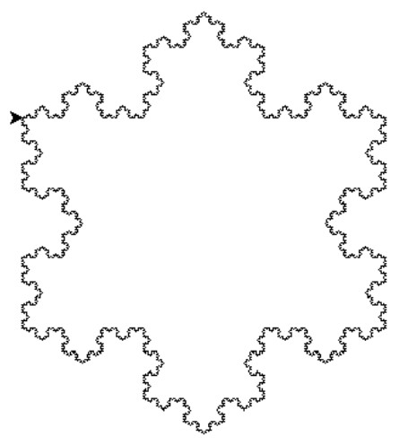

# Recursion Algorithms

This repository contains three Python programs that implement various algorithms and tasks. All programs are written using recursion and demonstrate basic file handling and graphics.

## Table of Contents

- [Task 1: Recursive File Copying](#task-1-recursive-file-copying)
- [Task 2: Koch Snowflake](#task-2-koch-snowflake)
- [Task 3: Towers of Hanoi](#task-3-towers-of-hanoi)
- [How to Run](#how-to-run)
- [Examples](#examples)
- [Requirements](#requirements)
- [License](#license)

## Task 1: Recursive File Copying

The program recursively copies files from a source directory to a new directory, sorting files into subdirectories based on their extensions.

### Functionality

- Recursively reads the contents of directories.
- Copies files into subdirectories based on their extensions.
- Handles exceptions for file access errors.

### Usage

```bash
python task_1.py <source_directory> [destination_directory]
```

- `<source_directory>`: Path to the source directory.
- `[destination_directory]`: Path to the destination directory (defaults to `dist`).

### Example

```bash
$ python task_1.py Temp
Copied: Temp\0PbvUGAZ to dist\no_extension
Copied: Temp\39fF@Jyt.jpg to dist\jpg
Copied: Temp\folder\=R8iWAfR.png to dist\png
Copied: Temp\folder\aX=XA13L.tar to dist\tar
Copied: Temp\folder\find_it\AuJBB7n=.zip to dist\zip
...

...
Files have been copied and sorted into dist.
```

## Task 2: Koch Snowflake

This program draws the Koch snowflake fractal using the `turtle` library. The user can specify the recursion depth to change the detail of the fractal.

### Functionality

- Prompts the user for the recursion depth.
- Displays the Koch snowflake on the screen.

### Usage

```bash
python task_2.py
```

### Example

```bash
$ python task_2.py
Enter the recursion depth: 5
```

<div align="center">
    
</div>

## Task 3: Towers of Hanoi

This program implements the Towers of Hanoi game, where disks are moved between three pegs according to the rules of the game.

### Functionality

- Prompts the user for the number of disks.
- Outputs the sequence of moves to transfer disks from one peg to another, showing the intermediate states of the pegs.

### Usage

```bash
python task_3.py
```

### Example

```bash
$ python task_3.py
Enter the number of disks: 3
Starting state: {'A': [3, 2, 1], 'B': [], 'C': []}
Move disk A to C: 1
Current state: {'A': [3, 2], 'B': [], 'C': [1]}
Move disk A to B: 2
Current state: {'A': [3], 'B': [2], 'C': [1]}
Move disk C to B: 1
Current state: {'A': [3], 'B': [2, 1], 'C': []}
Move disk A to C: 3
Current state: {'A': [], 'B': [2, 1], 'C': [3]}
Move disk B to A: 1
Current state: {'A': [1], 'B': [2], 'C': [3]}
Move disk B to C: 2
Current state: {'A': [1], 'B': [], 'C': [3, 2]}
Move disk A to C: 1
Current state: {'A': [], 'B': [], 'C': [3, 2, 1]}
Final state: {'A': [], 'B': [], 'C': [3, 2, 1]}
```

## How to Run

1. Clone the repository:

   ```bash
   git clone https://github.com/Iryna-Holova/goit-algo-hw-03.git
   cd goit-algo-hw-03
   ```

2. Follow the instructions of each task to see the output.

## Requirements

- Python 3.7+
- Standard Python libraries: `shutil`, `sys`, `pathlib`, `turtle`

## License

This project is licensed under the MIT License - see the [LICENSE](./LICENSE) file for details.
